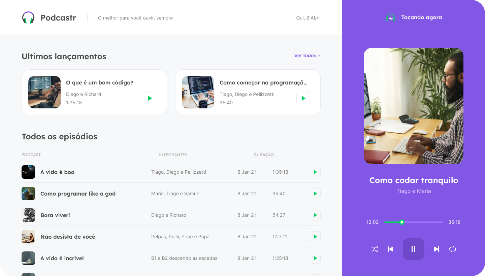

  
  
  

<h1 align="center">
  
</h1>

 

## ✨ Tecnologias

Esse projeto foi desenvolvido com as seguintes tecnologias:

- [React](https://reactjs.org)
- [Next.js](https://nextjs.org/)
- [TypeScript](https://www.typescriptlang.org/)

## 💻 Projeto

O podcastr é um app para reprodução de episódios em áudio do seu podcast favorito.

## 🔖 Layout

Você pode visualizar o layout do projeto através [desse link](https://www.figma.com/file/UwFEntsHpHYJlHNQAQr4gA/Podcastr/duplicate). É necessário ter conta no [Figma](http://figma.com/) para acessá-lo.

## 🚀 Como executar

- Clone o repositório
- Instale as dependências com `npm install`
- Inicie a fake api com `npm run dev:server`
- Gere a build com `npm run build`
- Inicie o servidor com `npm run start`

Agora você pode acessar [`localhost:3000`](http://localhost:3000) do seu navegador.

## 📄 Licença

Esse projeto está sob a licença MIT. Veja o arquivo [LICENSE](LICENSE.md) para mais detalhes.

---

Feito com ♥ by Guilherme e Rocketseat 👋🏻 [Participe da comunidade!](https://discordapp.com/invite/gCRAFhc)
